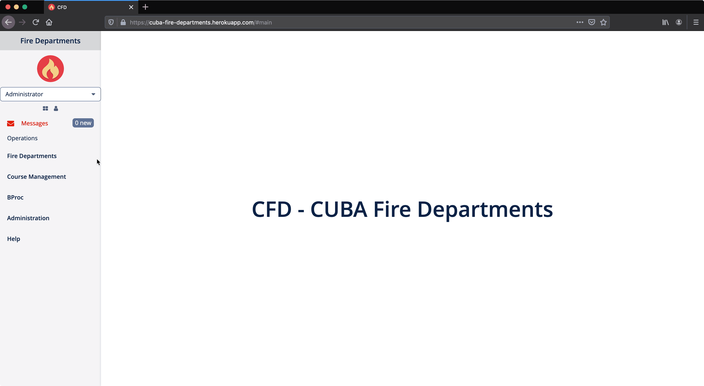

# CUBA Example: Fire Departments

Example application that uses CUBA Platform to build a simple Fire Departments Management System. It primarily uses the BProc addon to showcase different business processes in this domain.

## Running Application

https://cuba-fire-departments.herokuapp.com/

Login:

* `admin:admin` - Administrator
* `pogeez:pogeez` - User that only sees one Fire Department and related data

## Screenshots

## Business Processes

### Course Employee enrollment

The first business process deals with the topic of further education for employees of fire departments. When an employee would like to participate in a course, (s)he first needs to request enrollment by the course leader.

The course leader either decides to accept or reject the request. This decision might depend on the skillset of the employee or simply on the max. amount of employees who can fit into a single course room.

### Equipment Maintenance

The second business process deals with the topic of maintaining equipment of a fire department. In case a supervisor requests a maintenance for a given equipment, a task to schedule it is put to all mechanics of the corresponding fire department. The mechanic can either decide to schedule the maintenance within the requested week, or request a re-schedule.

When the maintenance is scheduled, it waits until the schedule day. Then a new task is appearing in the Task List of the mechanic who scheduled the maintenance.

When the maintenance is finished, the process ends. In case the maintenance was cancelled due to an urgent fire service, depending on the equipment type there is a last step to schedule the next maintenance. This decision is performed by a decision table.

